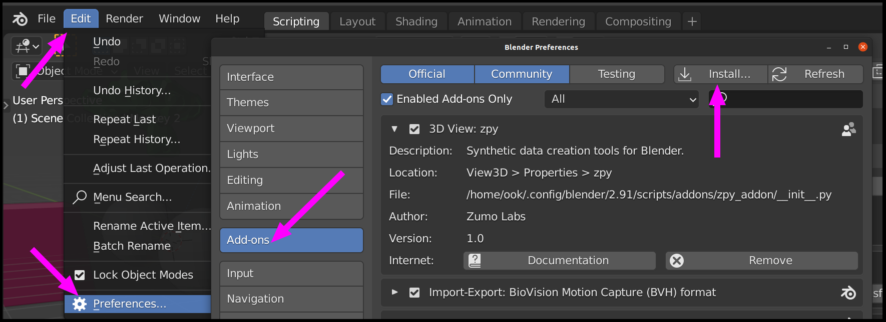

<div align="center">


**`zpy`: Synthetic data in Blender.**

<p align="center">
  <a href="https://zumolabs.ai/">Website</a> •
  <a href="#Install">Install</a> •
  <a href="#Examples">Examples</a> •
  <a href="#Contribute">Contribute</a> •
  <a href="#Licence">Licence</a>
</p>

[](https://pypi.org/project/zpy/)
[](https://badge.fury.io/py/zpy)
[](https://join.slack.com/t/pytorch-lightning/shared_invite/zt-f6bl2l0l-JYMK3tbAgAmGRrlNr00f1A)
[](https://github.com/ZumoLabs/zpy/blob/master/LICENSE)
</div>

## Abstract

Collecting, labeling, and cleaning data for computer vision is a pain. Jump into the future and create your own data instead! This synthetic data is faster to develop with, effectively infinite, and gives you full control to prevent bias and privacy issues from creeping in. We created `zpy` to make synthetic data easy, by simplifying the scene creation process and providing an easy way to generate synthetic data at scale.

## Install

``` 
$ /bin/bash -c "$(curl -fsSL https://raw.githubusercontent.com/ZumoLabs/zpy/main/install.sh?token=<token>)"
```

You can set `BLENDER_VERSION` `BLENDER_VERSION_FULL` and `ZPY_VERSION`for specific versions 

### Install: Within Blender

You can install the addon from within Blender itself. Navigate to "Edit -> Preferences -> Add-ons". You should be able to install and enable the addon from there there.



### Install: Developer Environment

TODO: Remove once made public 

If you are setting up a development environment it will be easier to symlink the zpy pip module directly into the Blender python library. This can be achieved with something like:

```
export BLENDER_VERSION="2.91"
export BLENDER_VERSION_FULL="2.91.0-276d19f63b45"
export BLENDER_PATH="$HOME/Downloads/blender-${BLENDER_VERSION_FULL}-linux64/${BLENDER_VERSION}"
export BLENDER_LIB_PY="${BLENDER_PATH}/python/lib/python3.7"
```

```
ln -s ~/zumolabs/zpy/zpy ${BLENDER_LIB_PY}/site-packages/
```

You can also symlink the zpy addon in this way. For linux this is:

```
mkdir -p ~/.config/blender/${BLENDER_VERSION}/scripts/addons
ln -s ~/zumolabs/zpy/zpy_addon ~/.config/blender/${BLENDER_VERSION}/scripts/addons/zpy_addon
```

If you use additional assets from our library, you can set it as an environment variable. Example:

```
export ASSETS="/home/ook/assets"
```

## Examples

**Tutorial**
- [Shapes]()

**Classification**
- [Transformers in Vision]()

**Object Detection**
- [Raspberry Pi Component Detection](https://towardsdatascience.com/training-ai-with-cgi-b2fb3ca43929)
- [Vote Counting](https://towardsdatascience.com/patrick-vs-squidward-training-vote-detection-ai-with-synthetic-data-d8e24eca114d)

**Segmentation**
- [Monkey Demo]()

## Contributing

We welcome community contributions! Search through the [current issues](https://github.com/ZumoLabs/zpy/issues) or open your own.

### Contributing: Cutting a Release

TODO: Remove once made public 

Fetch and list existing tags

```
git fetch --tag
git tag
```

Cut a release candidate (e.g. `v1.0.0-rc0`) or release (e.g. `v1.0.0`). Check progress on [CI](https://app.circleci.com/pipelines/github/ZumoLabs/zpy)

```
git tag ${ZPY_VERSION} && \
git push origin ${ZPY_VERSION}
```

Release Candidates are available to download through pip through explicit version or `pip install --pre zpy`

## Licence

This release of zpy is under the GPLv3 license, a free copyleft license used by Blender. TLDR: Its free, use it!

## BibTeX

If you use `zpy` in your research, we would appreciate the citation!

```bibtex
@article{zpy,
  title={zpy: Synthetic data for Blender.},
  author={Ponte, H. and Ponte, N. and Karatas, K},
  journal={GitHub. Note: https://github.com/ZumoLabs/zpy},
  volume={1},
  year={2020}
}
```
