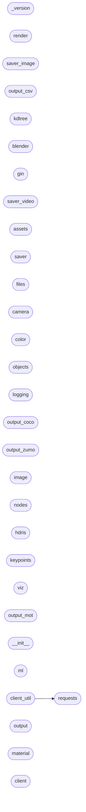

# Code Overview

[_Documentation generated by Documatic_](https://www.documatic.com)

<!---Documatic-section-Codebase Structure Python-start--->
## Codebase Structure Python

The codebase has a flat structure, with 30 code files.

<!---Documatic-block-system_architecture-start--->

<!---Documatic-block-system_architecture-end--->

# #
<!---Documatic-section-Codebase Structure Python-end--->

<!---Documatic-section-File IO-start--->
## File IO

<!---Documatic-block-file_io-start--->
The following files have file read operations

<!---Documatic-block-zpy-start--->

	
<code>zpy</code> (Click to Expand!)

* zpy._version
* zpy.color
* zpy.files: w, w
* zpy.logging
* zpy.ml
* zpy.output_coco
* zpy.output_csv
* zpy.output_mot
* zpy.output_zumo
* zpy.saver: w

<!---Documatic-block-zpy-end--->

The following files have file write operations

<!---Documatic-block-zpy-start--->

	
<code>zpy</code> (Click to Expand!)

* zpy.saver

<!---Documatic-block-zpy-end--->
<!---Documatic-block-file_io-end--->

# #
<!---Documatic-section-File IO-end--->

<!---Documatic-section-Class Hierarchy-start--->
## Class Hierarchy

<!---Documatic-block-Exception-start--->

	
<code>Exception</code> (Click to Expand!)

* zpy._version.NotThisMethod
* zpy.output_csv.CSVParseError
* zpy.requests.InvalidRequest

<!---Documatic-block-Exception-end--->

<!---Documatic-block-multiprocessing.Process-start--->

	
<code>multiprocessing.Process</code> (Click to Expand!)

* zpy.requests.Process

<!---Documatic-block-multiprocessing.Process-end--->

<!---Documatic-block-zpy.output.Output-start--->

	
<code>zpy.output.Output</code> (Click to Expand!)

* zpy.output_coco.OutputCOCO
* zpy.output_csv.OutputCSV
* zpy.output_mot.OutputMOT
* zpy.output_zumo.OutputZUMO

<!---Documatic-block-zpy.output.Output-end--->

<!---Documatic-block-zpy.saver.Saver-start--->

	
<code>zpy.saver.Saver</code> (Click to Expand!)

* zpy.saver_image.ImageSaver
* zpy.saver_video.VideoSaver

<!---Documatic-block-zpy.saver.Saver-end--->

# #
<!---Documatic-section-Class Hierarchy-end--->

[_Documentation generated by Documatic_](https://www.documatic.com)